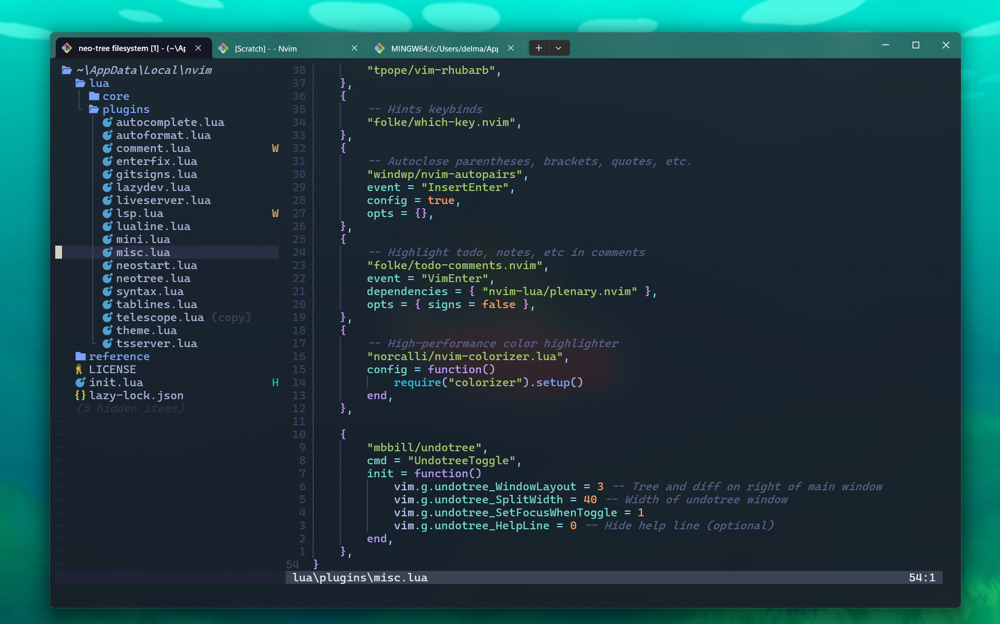

# 💤 Nvim-mino (Windows)



Welcome to my Neovim setup! — not the best but I wanted to share this for anyone using windows.

All plugins are \*\*lazy-loaded\*\* for faster startup and modularity.

---

## 📥 Installation (Windows)

1. Clone this repository to your Neovim config folder:
    ```powershell
    git clone https://github.com/wasubu/nvim-mino.git $env:LOCALAPPDATA\nvim
    ```

2. Launch Neovim:
    ```powershell
    nvim
    ```

3. `lazy.nvim` will automatically install itself and start fetching plugins.

---

## 📦 Plugin Overview

| Category | Plugin(s) | Description |
| --- | --- | --- |
| 🔌 Plugin Manager | \[folke/lazy.nvim\]([https://github.com/folke/lazy.nvim](https://github.com/folke/lazy.nvim)) | Fast, lazy-loading plugin manager |
| 📁 File Explorer | \[nvim-neo-tree/neo-tree.nvim\]([https://github.com/nvim-neo-tree/neo-tree.nvim](https://github.com/nvim-neo-tree/neo-tree.nvim)) | Modern file tree with fuzzy search, Git, diagnostics |
| ⚙️ LSP | \[neovim/nvim-lspconfig\]([https://github.com/neovim/nvim-lspconfig](https://github.com/neovim/nvim-lspconfig)) | Language Server Protocol support |
| 🧠 Autocomplete | \[saghen/blink.cmp\]([https://github.com/saghen/blink.cmp](https://github.com/saghen/blink.cmp)), \[hrsh7th/nvim-cmp\]([https://github.com/hrsh7th/nvim-cmp](https://github.com/hrsh7th/nvim-cmp)), \[LuaSnip\]([https://github.com/L3MON4D3/LuaSnip](https://github.com/L3MON4D3/LuaSnip)) | Fuzzy completion, snippet support |
| 🧼 Formatting | \[stevearc/conform.nvim\]([https://github.com/stevearc/conform.nvim](https://github.com/stevearc/conform.nvim)) | Asynchronous format-on-save and manual formatting |
| 🔤 Syntax | \[nvim-treesitter/nvim-treesitter\]([https://github.com/nvim-treesitter/nvim-treesitter](https://github.com/nvim-treesitter/nvim-treesitter)) | Syntax highlighting and code parsing engine |
| 🔍 Search | \[nvim-telescope/telescope.nvim\]([https://github.com/nvim-telescope/telescope.nvim](https://github.com/nvim-telescope/telescope.nvim)) | Powerful fuzzy finder UI |
| 💡 Key Hints | \[folke/which-key.nvim\]([https://github.com/folke/which-key.nvim](https://github.com/folke/which-key.nvim)) | Keybinding popup hints |
| 📐 Indentation | \[lukas-reineke/indent-blankline.nvim\]([https://github.com/lukas-reineke/indent-blankline.nvim](https://github.com/lukas-reineke/indent-blankline.nvim)) | Visual indent guides |
| 💬 Comments | \[numToStr/Comment.nvim\]([https://github.com/numToStr/Comment.nvim](https://github.com/numToStr/Comment.nvim)) | Toggle comments using \`gcc\`, \`gc{motion}\` |
| 🌐 Live Server | \[barrett-ruth/live-server.nvim\]([https://github.com/barrett-ruth/live-server.nvim](https://github.com/barrett-ruth/live-server.nvim)) | Preview HTML/CSS/JS in your browser |
| 🧑‍💻 Dev Tools | \[folke/lazydev.nvim\]([https://github.com/folke/lazydev.nvim](https://github.com/folke/lazydev.nvim)), \[pmizio/typescript-tools.nvim\]([https://github.com/pmizio/typescript-tools.nvim](https://github.com/pmizio/typescript-tools.nvim)) | Language-specific tools & dev enhancements |
| 🧾 Git | \[lewis6991/gitsigns.nvim\]([https://github.com/lewis6991/gitsigns.nvim](https://github.com/lewis6991/gitsigns.nvim)), \[tpope/vim-fugitive\]([https://github.com/tpope/vim-fugitive](https://github.com/tpope/vim-fugitive)), \[tpope/vim-rhubarb\]([https://github.com/tpope/vim-rhubarb](https://github.com/tpope/vim-rhubarb)) | Git signs, blame, and GitHub integration |
| 💻 UI & UX | \[nvim-lualine/lualine.nvim\]([https://github.com/nvim-lualine/lualine.nvim](https://github.com/nvim-lualine/lualine.nvim)), \[folke/tokyonight.nvim\]([https://github.com/folke/tokyonight.nvim](https://github.com/folke/tokyonight.nvim)), \[echasnovski/mini.nvim\]([https://github.com/echasnovski/mini.nvim](https://github.com/echasnovski/mini.nvim)), \[goolord/alpha-nvim\]([https://github.com/goolord/alpha-nvim](https://github.com/goolord/alpha-nvim)) | Statusline, colorscheme, startup screen, minimal plugins |
| 📑 Tabs & Buffers | \[romgrk/barbar.nvim\]([https://github.com/romgrk/barbar.nvim](https://github.com/romgrk/barbar.nvim)) | Tab-style buffer line |
| 🔄 Autopairs | \[windwp/nvim-autopairs\]([https://github.com/windwp/nvim-autopairs](https://github.com/windwp/nvim-autopairs)) | Auto-close brackets, quotes, etc. |
| 🎨 Colorizer | \[norcalli/nvim-colorizer.lua\]([https://github.com/norcalli/nvim-colorizer.lua](https://github.com/norcalli/nvim-colorizer.lua)) | Highlights color codes inline (e.g., \`#ff8800\`) |
| 🧠 Todo Comments | \[folke/todo-comments.nvim\]([https://github.com/folke/todo-comments.nvim](https://github.com/folke/todo-comments.nvim)) | Highlight and search TODO, FIX, HACK, etc. |
| 🧠 Tmux Nav | \[christoomey/vim-tmux-navigator\]([https://github.com/christoomey/vim-tmux-navigator](https://github.com/christoomey/vim-tmux-navigator)) | Seamless navigation between Vim and tmux |
| 🧠 Context Tools | \[tpope/vim-sleuth\]([https://github.com/tpope/vim-sleuth](https://github.com/tpope/vim-sleuth)) | Auto-detect indent settings |
| 💾 Undo Manager | \[mbbill/undotree\]([https://github.com/mbbill/undotree](https://github.com/mbbill/undotree)) | Visual undo history |

---

